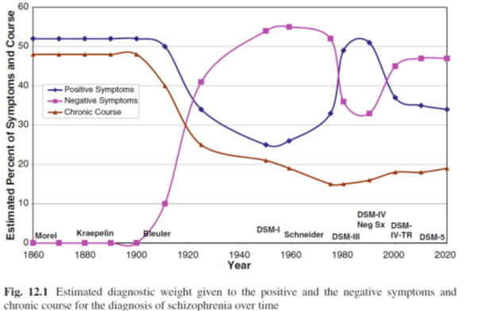

# 10장 1절. 음성 증상의 개념

음성 증상은 정서의 둔마(affect flattening), 무관심(apathy), 무쾌감증(anhedonia), 빈곤한 언어(speech impoverishment), 사회적 위축(social withdrawal)과 같은 다양한 정신병리학적 이상을 지칭한다. 음성 증상은 급성 정신병 단계뿐 아니라, 전구기 및 삽화 이후 어떤 단계에서도 발현될 수 있다(Naber, Lambert, & Krausz, 2002). 행동이나 심리적 기능의 결여나 심각한 저하를 의미하긴 하지만, 신경학적 손상에 의한 장애, 예를 들어 뇌졸중 후 나타난 실어증(aphasia) 또는 감각무시(sensory neglect)는 포함하지 않는다. 

음성 증상이 조현병에서 중요한 구성요소임은 오랫동안 강조되어 왔지만 항상 그래왔던 것만은 아니다. 크레펠린이 처음 조현병 개념을 정립할 때만해도 음성 증상은 진단 기준에 들어가지 못했으며, DSM이 바뀔 때마다 그 비중이 늘어났다 줄어들었다 하였다. DSM-5에서는 음성 증상이 진단에 반드시 필요한 핵심 증상에 포함되지는 못하였으나, A 기준의 다섯개 항목 중에는 엄연히 명시되어 있다.

​

(그림 1. 양성증상과 음성 증상의 진단적 중요도 추정치와 조현병 진단 후 만성적 경과) (Lake, 2012)

왼쪽: 증상과 경과에 대한 추정백분율

아래: 연도

가운데: 양성증상, 음성 증상, 만성적 경과

## 1-1. 개념의 역사

### 1-1-1. 초기 개념

조현병 환자의 증상을 양성과 음성으로 나누기 시작한 것은 1968년 소련의 정신의학자 Snezhnevsky에게서 비롯되었다.(Snezhnevsky, 1968) 그러나 이러한 구분은 좀더 오래전부터 정신의학자들 사이에 거론되었다. 좀더 넓은 맥락에서 병리학적 증상을 양성과 음성으로 나누기 시작한 것은 19세기 중반의 신경학자 Reynolds 였다.(Reynolds and Penry) 그는 간질환자가 보이는 증상 중에서 음성 증상은 활력적 기질(vital properties)이 결핍되어 생긴 감각상실, 마비, 혼수를 말하며, 양성 증상은 활력적 기질의 과잉으로 인한 경련성 반사운동, 비정상적 운동 및 환각/망상을 가리킨다고 하였다. 같은 시대의 신경학자 Jackson 역시 비슷한 주장을 내놓았다. 그는 병적 과정이 고위 중추에 이상을 일으키면 일차적으로 음성 증상이 발현되며, 덩달아 하위 중추에 대한 통제력이 상실되면서 탈억제가 일어나 양성 증상이 방출된다고 하였다.([10.1002/wps.20385](https://doi.org/10.1002/wps.20385)) 이는 당시 유행하던 스펜서의 진화론적 가설 혹은 신경계의 계층구조 모델과 맞물려, 저급하고 원시적인 충동이 조절되지 않고 표출되는 것이 양성 증상이라는 식으로 이해되었다. 이와는 대조적으로 EY (1962) 는 음성 증상은 기질적 이상에 의해 초래된 정신내부 구조의 상실을 반영하는 반면, 양성 증상은 건강한 뇌 부위에 의한 회복의 시도라는 독특한 가설을 제시하였다. 비록 Jackson의 이론을 답습하고 있지만, 정신 기능 사이에 어떤 것은 우월하며 어떤 것은 열등하다는 구분은 받아들이고 있지 않다.(Azorin, Belzeaux, & Adida, 2014).

크레펠린이 조발성 치매 환자에 대해 남긴 기록에도 음성 증상에 대한 내용이 들어있다. 그는 환자들이 보이는 주의력 결핍, 정신활동의 빈곤 등 인지적 결함과 함께 즐거움의 상실, 정서의 둔마, 동기 결여와 의지의 완전한 상실에 대해 기술하였다. 그가 본 환자들은 외부 세계에 무관심하고, 주변은 물론 자기 자신에게조차 관심이 없어져서 통증을 못 느끼거나 개인 위생도 챙기지 않는 상태를 초래한다고 하였다. 

블로일러는 겉으로 보이는 환자를 묘사했던 크레펠린과는 달리 환자 내부에서 벌어지는 눈에 보이지 않는 과정에 천착하였다. 그는 EY의 영향을 받아 조현병의 증상을 기본 증상과 보조 증상으로 구분하였다. 그에게 있어 연상의 와해, 정서의 둔마, 양가감정과 같은 기본 증상은 조현병의 핵심 병리를 시사하는 것과 동시에, 진단의 충분 조건이었다. 이에 비해 환각, 망상과 같은 보조 증상은 기본 증상에 이차적으로 유발된 증상이거나, 생체의 반작용에서 비롯된 비특이적인 현상일 뿐이었다. (Foussias, Agid, Fervaha, & Remington, 2014) 이상을 살펴보면 선구적 정신과 의사들은 오히려 음성 증상을 조현병의 핵심으로 여기고 있었음을 엿볼 수 있다. 그러나 핵심이 무엇인지를 왈가왈부하는 것보다, 실제로 환자를 구분해내는 것을 중시했던 동료 의사들은 점점 양성 증상에 비중을 두었다. 1950년대 정신약물학이 태동하면서 등장한 항정신병 약물은 주로 양성 증상에 효과적이었고, 의사들은 약에 반응할 것으로 기대되는 증상, 다시 말하여 양성 증상을 찾아내고 평가하는데 몰두하였다. 더군다나 DSM-III의 등장으로 신크레펠린 주의가 영향력을 넓혀가면서, 신뢰도가 떨어지는 막연한 음성 증상들은 진단 기준에서 하위로 밀려나게 되었다. 

또한 Carpenter, Heinrichs, and Wagman (1988) 은 음성 증상을 1차적인 음성 증상과 2차적인 음성 증상으로 구분하였으며 음성 증상이 지속되는 하위군을 "결핍증후군(deficit syndrome)"으로 분류하였다.

Snezhnevsky (1968)은 중추신경계 각성 수준의 감소로 음성 증상이 발생한다고 이해하였다. 음성 증상은 각성 수준이 지나치게 낮을 경우에, 반면 양성증상은 지나치게 높을 경우에 나타난다고 하였다. 비록 많은 지지는 받지 못했지만, 일부 연구자들은 이런 접근법을 음성 증상 중 사회적 위축 증상에 대해 실험적 연구에 이용하기도 하였다(Azorin et al., 2014; 古茶大樹, 2000).  

### 1-1-2. 현대적 개념

항정신병 약물이 도입되면서 정신의학계는 낙관적인 분위기에 휩싸였고, 환자 및 장애우의 인권이 강조되면서 금방이라도 탈시설화, 지역사회에서의 재활이 완료될 것이라는 기대감이 부풀었다. 그러나 낙관론은 잠시 뿐이었고, 아무리 양성 증상을 조절해도 지역사회로 돌아간 조현병 환자들이 제대로 적응하지 못한다는 것이 분명해졌다. 의사들은 조현병이 양성 증상의 합 이상의 것이며, 환자의 기능 회복 및 재활에 결정적인 역할을 하는 것은 그때까지 간과해왔던 또 다른 증상 영역임을 깨닫게 되었다. 1970년대 중반이 되면서 다시금 양성과 음성 증상의 구분이 보편적으로 받아들여졌고, 조현병의 아형, 불량한 예후의 예측 인자 등과 같은 연구 주제가 제시되었다. (Andreasen, 1982; T. Crow, 1980; J. S. Strauss, Carpenter, & Bartko, 1974). 

1974년에 Strauss등은 조현병 증상을 양성, 음성 증상 및 대인관계의 장애라는 세 그룹으로 나눌 것을 제안하였다(J. S. Strauss et al., 1974). 양성 증상이란 환각이나 망상, 혹은 긴장증 등을 말하며, 음성 정상이란 정서의 둔마, 사고형식의 장애와 같은 정상 기능의 결손을 의미한다고 하였다. 전자는 비교적 단기간에 발현되었다가 해소되는 등 변동이 심하고, 다양한 유발인자에 의해 촉발되는 비특이적인 반응이라고 하였으며, 후자는 만성적이고 잘 변화하지 않으며, 궁극적 예후를 결정짓는다고 하였다. 양성 및 음성 증상은 한 환자에서도 혼합되어 나타나는 서로 다른 종류의 증상으로 이해되었으나, Crow 같은 학자들은 음성 증상을 주로 보이는 환자들은 조현병의 아형 자체가 다르다고 주장하였다. Crow (1980)는 조현병을 제 1형 (type I)과 2형 (type II)으로 나누고, 도파민 전달 이상으로 발생하는 1형과는 달리 2형은 좀 더 어린 나이에 뇌의 구조적 이상을 동반하며, 통상적인 항정신병 약물에 반응하지 않는다고 하였다. 물론 Crow도 1형과 2형이 독립된 질병 단위라고 주장하지는 않았고, 두 유형 사이에 전환 가능성도 언급했다. 그러나 2형은 애초부터 예후가 불량하며 일단 2형의 양상을 띠기 시작한 환자들이 1형으로 다시 돌아가는 경우는 드물다고 보았다. 이러한 견해는 후에 Carpenter가 주장한 결핍 조현병(deficit schizophrenia)에 영향을 주었으며, 초발 삽화에서부터 치료저항성을 보이는 환자가 따로 있다는 현대적 견해를 낳기도 했다.

음성 증상 연구의 전환의 계기를 마련한 것은 미국의 Andreasen이었다. 그녀는 1982년 최초로 음성 증상 평가에 최적화된 평가도구인 Scale for the Assessment of Negative Symptoms (SANS)를 발표한다. Crow의 유형 구분보다는 한 환자에서 혼재되어 있을 수 있는 증후군의 개념으로 음성 증상을 바라보았으며, 근본적으로는 블로일러의 기본 증상을 음성 증상이라는 이름으로 재포장하여 세상에 내놓은 셈이 되었다. SANS에 포함된 음성 증상에는 정서의 둔마, 무언어증, 무의욕-무관심, 무쾌감증-비사회성, 주의력 장애의 다섯 항목이 포함되었다. 이러한 내용을 살펴보면, 인간이 외부 세계에 관심을 보이다가 그 중 무언가를 해보려는 의욕을 보이고, 성취를 이루면서 쾌감을 느끼며, 그러는 와중에 사람들과 연결을 맺으려 하는 것들을 당연히 갖춰여야할 인간의 본성이라고 간주하는 것을 볼 수 있다. 또한 아직까지 음성 증상과 인지 증상이 구분되지 않고 있다는 것 또한 엿볼 수 있다.

Carpenter 등(1988)은 음성 증상을 원발성과 속발성으로 구분하였다. 그는 음성 증상이라고 여겨지는 증상 중 적지 않은 부분이 치료의 부작용이거나, 사회적 소외나 우울/좌절에 의한 정상적 반응일 수 있음을 지적하였다. 그에 비해 원발성 음성 증상은 핵심적 병리현상의 표현으로 전두엽-측두엽-두정엽의 전반적 기능 부전때문에 발생하며, 치료에 저항하는 “결핍 증후군 (deficit syndrome)”을 발생시키고 지속시킨다는 가설을 세웠다.

결핍 증후군은 조현병이 만성화되어 더 이상 호전을 기대하기 힘든 퇴화된 환자(deteriorated schizophrenia)와는 구분되어야 한다. 물론 질병이 만성화될수록 음성 증상이 우세하게 나타나는 것은 사실이지만, 결핍 증후군이란 질병 경과 초기부터 임상양상을 주도하는 음성 증상을 의미한다. 연구자들이 제시하는 진단기준은 1) 제한된 정서, 2) 감정 표현의 감소, 3) 언어의 빈곤, 4) 관심/흥미의 감소, 5) 삶의 목적 상실, 6) 사회적 관계에 대한 욕구 저하 중 적어도 2개 이상이 지난 12개월 동안 상태가 안정적일 때도 지속되어야 하며, 이러한 증상이 원발성이어야 한다는 것이다. (18836581) 이러한 양상은 초발 삽화에서부터 드러나기 때문에, 연구자들은 결핍 증후군과 그렇지 않은 조현병을 별개의 질환 혹은 별개의 아형으로 구분해야 한다고 여긴다. 그 이유는 증상, 경과, 병인, 치료 반응 등에 있어서 근본적으로 차이가 있는 것처럼 보이기 때문이다. 이들은 치료 반응이 좋지 않고, 삶의 질이 떨어지며, 장기적 예후가 훨씬 불량하다. 그렇다고 해서 결핍 증후군 환자가 나타내는 음성 증상과 그렇지 않은 환자들이 보이는 음성 증상이 근본적으로 다르다고 보이진 않는다. 두 군을 명확히 나누는 기준은 존재하지 않지만, 전체 조현병 환자의 15\~20%에 해당한다고 여겨진다. (16481659)

결핍 증후군과는 별개로 지속적인 음성 증상(persistent negative symptom)이란 개념이 있다. 이는 양성 증상이 안정되었음에도 불구하고 중등도 이상의 음성 증상이 지속되는 것을 의미한다. 이는 결핍 증후군과는 달리 별도의 아형이라 여겨지지는 않으며, 지속시간도 6개월 이상으로 기준이 덜 엄격하다. (17099070)

이상에서 살펴본 개념의 역사적 변천 과정을 보면, 조현병의 핵심을 파악해내려던 학자들이 처음 주목한 것도 음성 증상이요, 궁극적 예후를 결정하는 요소로 지목된 것도 음성 증상이었다. 그러나 음성 증상만으로는 비특이적이기 때문에 그것만 갖고 조현병이 성립되는지는 의문의 여지가 있었고, 또 그것이 다른 증상의 원인인지, 결과인지, 아니면 독립적인 것인지에 대해서도 결론이 나지 않았다. 뚜렷이 눈에 보이는 양성 증상과는 달리, 음성 증상은 “\~이 아닌 것”이라는 식의 모호한 정의 속에서 정작 본모습이 가려져 있다. 그럼에도 불구하고 음성 증상에 대한 정체규명에 연구자들이 매달리는 이유는, 양성 증상의 치료만으로는 전혀 해결되지 않기 때문이다. 결핍 증후군 환자들에 대한 독립적인 연구를 통해 음성 증상의 병태생리에 대한 보다 깊은 이해에 도달하면, 보다 진일보한 치료법을 개발할 가능성도 있어 보인다.

​

표 2. 조현병 음성 증상의 역사(Lake, 2012; 古茶大樹, 2000).  

제일 위칸:  번호, 저자, 출판연도, 조현병의 진단적 용어 기술

 

 

## 1-2. 음성 증상의 임상적 특성

보통 양성 증상이란 없어야 할 것이 나타나는 것을 의미하며, 음성 증상이란 정상적으로 나타나야할 정신 기능이 결핍된 것을 가리킨다. 대표적 증상은 능동적 정서표현과 의욕의 상실이며, 그 밖에 무언어증, 쾌감의 상실, 대인관계 회피가 주로 언급된다. 음성 증상이 있는 환자들은 매사에 무관심하고 아무 일도 하지 않으려 하기 때문에, 게으르거나 나태한 것으로 오해를 받는다. 우울증 환자와의 차이라면, 우울증 환자들은 이러한 자기 모습에 고통받는데 비해, 조현병 환자들은 고통을 겉으로는 잘 드러내지 않는다는 것이다. 이론이 그렇다는 것이지 조현병 환자의 반수 이상이 임상적으로 의미있는 우울 증상을 보이기 때문에, 음성 증상과 우울 증상을 감별하기란 쉽지 않다. 그 밖에 항정신병 약제로 인한 무의욕, 무동증도 원발성 음성 증상과 거의 구분이 불가능하다.

 

정서의 둔마(affective flattening 또는 blunted affect)에서 “둔마”라는 용어는 자극에 대한 반응으로서 겉으로 드러나는 정서적 표현의 이상을 말한다. 얼굴 표정의 감소, 제스처와 신체 언어의 감소, 말하는 소리의 크기, 음색, 속도의 어색함이라는 요소들을 포함한다.(Kirkpatrick & Fischer, 2006) 이는 동일한 자극에 대해 건강한 사람이라면 나타낼 것으로 기대되는 감정의 강도나 폭을 기준으로 평가를 하게 된다. 문제는 그런 절대적 기준이 있을리 만무하다는 것이다. 개인적 성향이나 문화적 차이에 따라 감정표현이 다채로울 수도 무미건조할 수도 있다. 또한 환자들이 겉으로 드러나는 표현 뿐 아니라 내면에서도 아무런 감정을 못 느끼는 지는 확실하지 않다. DSM-5는 이를 의식해서인지 정서의 둔마라는 용어 대신 “감정 표현이 줄었다(diminished emotional expression)”는 식으로 표현을 순화하였다.

절대적 기준이 없는 만큼 정서의 둔마는 이들과 교류하는 의사가 느끼는 어색함과 불편감에 근거하여 진단하곤 한다. 환자들은 대화를 할 때 얼굴 표정의 변화가 없고 눈을 마주치지 않는다. 자신의 생각을 표현할 때도 제스처를 사용하지 않으며, 강조하는 부분에 따른 억양 변화를 보이지 않는다. 평가는 면담 중에 관찰된 자발적인 정서 표현과 면담자의 자극에 대해 반응하는 정서적 표현에 근거한다. 얼굴 표정을 객관적으로 측정하는 코딩 시스템을 동원하여 시행한 연구에서는, 약물치료 여부에 상관없이 모든 조현병 환자가 건강인에 비해 얼굴 표정의 빈도와 강도가 감소하였다.(Ekman & Friesen, 1976; Kring & Sloan, 2007) 목소리를 연구한 결과 역시도 환자들은 목소리를 통한 정서적 표현이 양도 감소하였고, 내용과도 불일치 하였다.(Trémeau, 2006). 제스처를 양적으로 분석한 연구 역시 마찬가지로 머리와 몸의 움직임, 시선, 몸짓 등을 포함한 환자의 비언어적 행동이 전체적으로 감소되어 있다고 보고한다(Brüne et al., 2008; Kupper, Ramseyer, Hoffmann, Kalbermatten, & Tschacher, 2010; Lavelle, Healey, & McCabe, 2013). 정서의 둔마는 약물을 복용하지 않은 환자에서도 관찰되나, 약물의 이차적 결과일 수도 있기 때문에 부작용 가능성을 철저히 배제한 후에나 제대로 평가할 수 있다. 

무언증(alogia)은 언어적 표현이 감소하는 것으로 양적 빈곤과 내용적 빈곤의 두 가지 양상으로 나타난다. 환자들은 기껏해야 단음절로 대답하거나 어떤 질문에는 아예 입을 다물어 버린다. 고의적으로 말을 안하려 애쓰는 함구증과는 조금 다르며, 말하는데 전혀 의욕이 없는 것처럼 보인다. 한편 내용의 빈곤을 보이는 환자는 말은 많지만 사용하는 언어가 애매모호하고 지나치게 추상적이거나, 반복적이고 상동적이어서 제대로 된 내용이 전달되지 않는다. 

무의욕(Avolition) 또는 무욕동(amotivaion)은 흥미, 욕망, 목표에 대해 환자 스스로 느끼는 주관적인 감소와 기껏 시작한 목적 지향적 활동을 끝내지 못하는 양상을 모두 포함한다. 환자는 활력이 없고, 관심과 흥미, 의지나 의욕을 상실한 듯이 보인다. 어렵사리 일을 시작한다고 해도 지속적으로 책임감 있게 수행하지 못하고 곧 그만두어 버린다. 대부분의 시간을 빈둥거리며 보내며, 외모나 위생상태에도 신경을 쓰지 않는다. 게으르다는 오해를 자주 받지만, 실제로는 장기계획을 수립하고 추구하는 능력과 기본적인 의욕이 상실되었기 때문이다. 이는 사회적 기능 회복을 가로막으며, 살아가는 의미를 고갈시킨다.

그러나 이런 용어들은 관찰자의 가치관이 반영되어 있다. 모름지기 인생의 의미란 무언가에 의욕을 쏟고 어려움을 극복하여 성취해내는 것이라고 믿는 의사라면, 대부분의 환자를 무의욕 환자로 몰아갈 것이다. 그러나 환자가 쉽사리 시도를 못하는 것은, 무의욕, 무욕동 때문일 수도 있지만, 실패에 대한 두려움이나, 대인관계의 부담, 의심/피해사고, 오랫동안 의지하고 살다보니 스스로 일해야할 필요성을 느끼지 못하는 것 등 또 다른 원인들이 있을 수 있다. 또한 욕망 추구와 성취보다는 마음의 평화를 선택한 결과일 수도 있다.(Marder & Galderisi, 2017). 

무쾌감증(anhedonia)은 긍정적인 자극으로부터 즐거움을 경험하지 못하는 것을 말하는데, 환자들은 자신이 감정적으로 텅 비어 있는 느낌이라고 말한다. 환자는 이전에 즐거웠던 활동, 예를 들면 취미 활동이나 가족/친지를 만나는 일에 더 이상 흥미를 느끼지 못한다. 이성에 대한 관심이나 성관계의 즐거움도 느끼지 못한다. 그래서 특별히 피해사고가 없는 경우에도 사회적 관계를 맺지 않고 고립된 생활을 한다.

이 역시 인간은 적극적으로 즐거움을 찾고 누려야 한다는 의사의 가치관이 배어있을 수 있다. 면담을 통해서는 긍정적 감정(positive emotion)을 경험하는 횟수가 감소된 것처럼 보이지만, 잘 통제된 실험적 환경하에서는 건강한 대조군과 별 차이가 없었다는 보고들이 있다.(Cohen & Minor, 2010; Kring & Moran, 2008; Llerena, Strauss, & Cohen, 2012) 환자들이 추구하는 즐거움과 정상인들이 추구하는 즐거움의 종류가 다를 지도 모른다. 최근 연구결과에 의하면 긍정적인 경험을 하고 있거나 하고 났을 때 느끼는 쾌감은 비교적 잘 보전되어 있는 반면, 미래의 즐거움을 기대하는 능력은 상당히 감소되어 있다고 한다. (Barch & Dowd, 2010; Gard, Kring, Gard, Horan, & Green, 2007; Mucci et al., 2015) 정상인은 미래의 즐거움을 예상하고 이를 손에 넣기 위해 현재에 애쓰며 살아가지만, 환자들은 그렇지 못하기 때문에 의욕을 내기 힘들 지도 모른다. 즐거움과 동기부여는 뗄레야 뗄 수 없는 연관이 있다.(Marder & Galderisi, 2017).

비사회성(asociality)은 사회적 관계에 대한 욕구가 줄거나 피하려는 경향을 말한다. 종종 발병 전 전구기 때부터 두드러진다. 관찰된 행동이 아니라, 사회적 접촉에 대한 욕구 자체가 줄어든 것이 중요하다. 사람과 교류하고 싶은 마음은 여전한데, 정신병적 증상, 의심, 열등감, 우울감, 그리고 투병 생활로 사람을 만날 기회 자체가 줄어든 것은 음성 증상이라 간주하지 않는다.

SANS는 주의력 장해를 음성 증상에 포함시키고 있다. 환자들은 한 가지 과업에 주의를 집중하지 못하고, 외부로부터의 유입되는 다양한 자극을 걸러내지 못하기 때문에 혼란에 빠지거나 자극을 차단하려 한다. 그러나 이 증상은 음성 증상 보다는 인지 증상으로 분류해야 맞을 것이다.(Foussias & Remington, 2010).  

 

최근 학자들이 음성 증상으로 분류하는데 의견의 일치를 보인 증상들은, SANS에 포함된 항목 중 주의력 장애를 제외한 정서의 둔마, 무언어증, 무의욕증, 무쾌감증, 비사회성이다. 이들 각각에 대하여 약물 부작용이나 양성 증상 혹은 우울증에 의한 것인지를 확인하고, 만약 그렇다면 원발성 음성 증상 진단을 내리지 않는다. 이들은 크게 처음 두 개와 나머지 세 개 증상으로 구성되는 두 개의 요인으로 묶인다. ([10.1002/wps.20385](https://doi.org/10.1002/wps.20385)) 두 요인 중 어느 쪽이 더 두드러 지느냐에 따라 임상적 차이가 발견되기도 한다. 정서 둔마/무언어증이 두드러진 집단은 급작스런 발병, 잦고 오랜 입원, 전반적 인지기능 저하의 특징을 보였으며, 무의욕/무쾌감/비사회성을 주로 나타낸 집단은 남성, 점진적 발병, 소아기 병적 적응 정도가 낮은 특성을 보였다. (Faerden et al., 2009; G. P. Strauss et al., 2013). 이를 바탕으로 미국 국립정신건강연구원의 Measurement and Treatment Research to Improve Cognition in Schizophrenia (MATRICS) consensus panel에서는 음성 증상을 두 개의 차원으로 나누어 평가한다.(Kirkpatrick, Fenton, Carpenter, & Marder, 2006).  

## 1-3. 음성 증상과 질병 단계

  

음성 증상은 조현병의 모든 단계에서 나타날 수 있지만, 결국 질병이 만성화 되면서 상대적으로 점점 두드러진다. 전구기에서 음성 증상은 미세하게 나타나며, 정상과의 경계가 불분명하기 때문에 그 시작을 눈치채기 어렵다. 발병이 뚜렷해진 연후에야 비로서 과거에 음성 증상을 보여왔다는 것을 깨닫게 될 뿐이다. 급성기에서 양성 및 음성 증상이 동시에 나타나면 양성 증상이 임상상을 압도하여 음성 증상을 가릴 수 있다. 양성 증상이 심한 환자가 자기 방에 틀어박혀 나오지 않으려 한다면, 피해사고로 평가하지 비사회성으로 평가하진 않을 것이다. 양성 증상이 가라앉고 난 후에도, 정상 생활로 돌아오지 못하는 환자를 보았을 때 비로소 음성 증상때문이라고 탓을 돌리는 것이 고작이다. 그러나 실제로는 급성기에 양성 증상이 심한 중에도 음성 증상이 존재할 수 있다. 다만 양성 증상이 먼저 가라앉기 때문에 음성 증상이 뒤늦게 찾아오는 것처럼 보일 뿐이다. 정신병후 우울증 혹은 관해 후 탈진 상태(postremissive states of exhaustion)라 불리워지는 상태가 사실은 음성 증상의 잔류 형태일 가능성도 있다.

치료에 의한 증상의 변화 양상을 추적한 Biehl 등(1986)에 의하면, 질병의 초기 단계에서는 치료로 두 증상 모두 감소하나, 이후 양성 증상은 삽화적으로만 나빠지는 반면 음성 증상은 서서히 증가한다. 유사하게 Marneros 등(1995)도 삽화가 거듭될수록 음성 증상이 더 증가하고 양성 증상이 우세한 에피소드는 줄어든다고 하였다. 초발 단계에서의 음성 증상은 치료저항성 및 나쁜 예후와 상관이 있다.(Marneros et al., 1991) 그러나 다른 중요한 요인들(예를 들면, 병전 인격, 정신병의 비치료 기간, 사회적 지지체계, 그리고 이차성 음성 증상의 가능성)때문에, 발병 초기의 음성 증상이 의미있는 예측력을 갖기 어렵다는 주장도 있다(Naber et al., 2002).  

 

## 1-4. 음성 증상과 인지장애

현대에 와서는 음성 증상과 인지 증상을 뚜렷이 구분하는 편이지만, 과거에는 그렇지 못했고, 따라서 음성 증상이라고 분류되었던 증상 중 다수는 사실 인지 증상으로 보는 것이 옳을 수 있다. 특히 최근에는 정서적 인지, 사회적 인지 등 인간관계를 부드럽게 만드는 많은 요인들이 특정한 인지기능에 기초하고 있다고 생각하는 추세이기 때문에 더욱 그러하다. 이렇듯 인지장애가 음성 증상을 결정짓는데 중요한 역할을 하지만, 둘을 한 범주로 묶기에는 여전히 설명되지 않는 차이점이 있다.

음성 증상과 연관된다고 여겨지는 뇌 부위 역시 인지 영역과 상당히 겹친다. 조현병 환자들이 행동 특징은 전전두엽 손상 환자들과 비슷하다. 계획성과 사회적 판단력의 결핍, 둔마된 정동, 무의욕, 무쾌감증, 보속증과 억제의 감소는 배외측(dorsolateral) 혹은 안와전전두엽에 손상을 입은 환자에서도 흔히 드러난다. 언어의 양적 혹은 내용적 측면에서의 빈곤은 집행기능의 저하와도 관련이 있다. 조현병 환자들은 위스콘신 카드분류 검사와 같이 집행기능에 민감한 과제에서 저조한 수행을 보이며, 과제요구가 변화하는 상황에서 새로운 대안으로 전환하지 못한다. 이는 순간순간 분위기와 맥락이 바뀌는 대인관계 상황에 적응하기 힘들게 한다. 

그러나 Addington 등(2000)에 따르면, 인지 기능 중 몇 가지가 음성 증상과 상관관계를 보이긴 했으나, 특정 음성 증상과 특정 인지 기능간의 선택적 상관성은 보이지 않았고, 전체적인 설명력도 약 10% 정도에 그치고 있었다. Harvey 등(2006) 역시 음성 증상과 인지 증상은 밀접한 상관성이 있지만, 서로 독립적인 원인으로부터 생겨나거나, 제 3의 요인에 공통적으로 영향을 받을 수 있다고 하였다.

앞에서 언급했듯이 아직 파헤치지 못한 인지 기능의 다각적 측면들이 하나하나 드러나면서, 음성 증상과의 관계도 새롭게 이해되고 있다. 보상 및 처벌을 통한 학습능력을 조사한 연구에서, 조현병 환자는 긍정적 보상으로부터 학습하는 능력이 유달리 부족한 것으로 나타났다. 더욱이 이것은 음성 증상과 중등도 수준의 유의한 상관관계가 있지만 표준적인 인지기능과는 상관이 없었다. 이러한 결과는 인지기능 장애가 동기 부여와 유지에 악영향을 미치고 있을 가능성을 나타낸다.(Foussias et al., 2014).  

 

## 1-5.  음성 증상의 평가

전통적으로 음성 증상을 평가하는데 사용되어온 척도는 아래와 같으며, 이를 1세대 평가 척도라고 칭하기도 한다.

* Global Assessment of Functioning (GAF)
* Positive and Negative Syndrome Scale (PANSS)
* Scale for the Assessment of Negative Symptoms (SANS)
* Schedule for Affective Disorders and Schizophrenia (SADS)
* Schedule for the Deficit Syndrome (SDS)

몇몇 전문적인 평가도구가 개발되었음에도 불구하고, 임상이나 연구 모두에서 가장 보편적으로 많이 쓰였던 것은 PANSS이다. PANSS의 음성 증상 척도는 7개의 문항으로 이루어졌으며, 정서의 둔마 감정적/사회적 철폐 등이 포함되어 있다. 그러나 추상적 사고의 어려움, 상동적 사고 등 사고 형태의 장애에 해당할 것처럼 보이는 항목이 들어있으며, 무의욕/무쾌감에 대한 평가항목이 없는 등 충분히 포괄적이진 못하다. 

심리검사, 신경생물학 및 정신병리 분야에서 이루어진 진보와 함께 조현병의 음성증후군을 평가하기 위한 측정 도구는 지난 30 년 동안 진화하면서 개정되어 왔다. 2005년 NIMH가 음성 증상에 대한 합의를 도출하기 위한 컨퍼런스를 조직하였으며, 합의된 성명서에서는 음성 증상이 특정 신경생물학적 기질과 상관이 있을 수 있고 독립된 치료적 표적이 될 수 있다고 발표하였다. 또한 음성 증상의 하위 영역에 대한 더 명확한 정의와 새로운 평가 도구의 개발을 촉구했다. 음성 증상에 대한 NIMH-MATRICS Consensus Panel은 음성 증상으로 합의된(1-2절 참조) 다섯 가지 영역을 평가하는 새로운 도구를 개발할 것을 목표로 삼았다. 이를 위해 Collaboration to Advance Negative Symptom Assessment of Schizophrenia (CANSAS)가 결성되었고, 그 결과 두 개의 차세대 음성 증상 척도인 Clinical Assessment Interview for Negative Symptoms (CAINS)와 Brief Negative Symptom Scale (BNSS)가 개발되었다.(10.1016/j.schres.2011.06.030, 10.1093/schbul/sbq059) 둘다 잘 훈련된 면담자에 의해 시행되는 구조화된 면담이며, 모두 13개 문항으로 구성되었다. 원래 BNSS는 임상에서 짧은 시간 내에 손쉽게 사용하는 것을 목적으로 하였고, CAINS는 보다 정확하고 포괄적인 평가를 할 수 있도록 개발되었다. 비록 개발 과정에서 동일한 문항수를 지니게 되었으나, CAINS가 시간이 더 오래 걸린다.(27174556)

CAINS와 BNSS 그리고 이후 개발된 척도들을 통털어 2세대 평가 척도라고 칭한다. 1세대 평가 도구들이 행동의 외적인 결과만을 중시하여 내적 경험에서의 결핍을 제대로 평가히지 못한 반면, 2세대 도구들은 실제 행동과 내면적 경험을 동시에 조사하며 그 차이에 대해서도 세심하게 다룬다. 무쾌감을 평가하는 부분에서도 과거의 즐거운 경험 및 미래에 예상되는 즐거운 경험을 따로 물어봄으로써 두 측면이 구분되는 차원임을 분명히 한다. 

그러나 CAINS와 BNSS 모두 지침이 상당히 복잡하여, 잘 훈련된 평가자만이 평가할 수 있다. 이에 비해 1세대와 2세대 중간에 위치하고 있는 Negative Symptoms Assessment 16 (NSA-16)과 그 축약판인 NSA-4는 의사가 진료실에서도 사용할 수 있는 간단한 평가 도구이다. (2602512, 21538654) NSA-4는 자발적 언어의 양, 감정 표현의 폭, 사회적 욕동의 정도, 흥미의 감소라는 4가지 항목에 대해 각각 6점 척도로 평가하며, 이와는 별도로 전체적인 음성 증상에 대해 7점 척도로 평가한다. 하지만 평가가 간단해지면서 환자의 외적 행동에 중점을 두는 경향이 있기 때문에, 1세대 척도의 단점으로 꼽히던 음성 증상이 아니라 사회적 기능을 측정한다는 비판에서 자유롭지 못하게 되었다.

